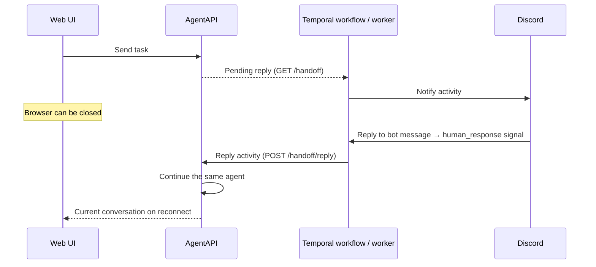

# Continue an AgentAPI session from Discord

Keep using the AgentAPI web UI normally. The optional `agentapi discord`
process watches the same backend, uses Temporal to send Discord notifications
and wait for replies, and submits those replies to the existing agent. Closing
the browser does not stop the agent or the bridge.



## Setup

Build the binary with `make build`. Keep the following processes running on
the server (for example, in a process supervisor). The browser can come and go.

1. Run Temporal, or connect to an existing Temporal namespace. For local
   development, install the Temporal CLI and use a persistent database:

   ```bash
   temporal server start-dev --db-filename ./temporal-dev.db
   ```

   The development server uses `localhost:7233`; its UI is at
   `http://localhost:8233`. Use Temporal Cloud or a production Temporal
   deployment for a production service. See the
   [Temporal server CLI reference](https://docs.temporal.io/cli/command-reference/server).

2. Start AgentAPI as usual:

   ```bash
   ./out/agentapi server -- claude
   # Or: ./out/agentapi server --type=codex -- codex
   ```

3. Create a Discord application/bot and invite it into your server. Enable
   **Message Content Intent** in its Bot settings. Give it **View Channel**,
   **Send Messages**, **Embed Links**, **Read Message History**, and
   **Add Reactions**, **Create Public Threads**, and **Send Messages in Threads**
   in the notification channel. Get the channel ID and your
   user ID using Discord's Developer Mode. This integration uses a bot's
   outbound Gateway connection; it does not require a public callback URL.
   See [Discord Gateway intents](https://docs.discord.com/developers/events/gateway).

4. Start the bridge in another terminal or service, with credentials supplied
   from the saved Temporal configuration:

   ```bash
   ./out/agentapi discord --config .agentapi/temporal.json
   ```

   The configuration file contains the AgentAPI token, Temporal API key, and
   Discord bot token. Protect this file because stored credentials are plaintext.

   If AgentAPI requires authentication, set `AGENTAPI_API_TOKEN` in the bridge
   to the same token used by the server. The bridge does not automatically
   discover a server's randomly generated token.

5. Send a task in the web UI. Once the agent is stable with a response and
   there are no queued tasks, Discord receives an excerpt of its response.
   Use Discord's **Reply** action on that bot notification to send the next
   instruction. Unrelated messages in the channel are ignored.

For recognized numbered terminal confirmation dialogs, reply with a displayed
number (for example `2`), `enter`, or `esc`. Numbers are sent with Enter, matching
the web UI's option buttons. Other text is rejected for terminal requests, which
remain open so you can correct the reply. For a regular conversation response,
your reply is submitted as a normal user message and appears in the chat history.

### Coolify with Docker Compose

Use [`docker-compose.discord.yml`](../docker-compose.discord.yml) as the
Coolify Compose file. Set the image and connection values in Coolify's
environment settings:

```text
AGENTAPI_DISCORD_IMAGE=ghcr.io/<owner>/<repo>/agentapi-discord:latest
AGENTAPI_DISCORD_AGENT_URL=https://agentapi.example.com
TEMPORAL_ADDRESS=your-namespace.tmprl.cloud:7233
TEMPORAL_NAMESPACE=your-namespace
TEMPORAL_TLS=true
TEMPORAL_API_KEY=...
DISCORD_BOT_TOKEN=...
DISCORD_CHANNEL_ID=...
DISCORD_ALLOWED_USER_IDS=...
AGENTAPI_API_TOKEN=...
```

The Worker makes outbound connections to AgentAPI, Temporal, and Discord, so it
does not need a public domain or an exposed port in Coolify. If AgentAPI or
Temporal runs in another Coolify resource, use its internal hostname and port.
To use a saved config instead, mount it at `/data/temporal.json` and set
`AGENTAPI_TEMPORAL_CONFIG=/data/temporal.json`.

## Configuration

| Environment variable | CLI flag | Default / purpose |
| --- | --- | --- |
| `AGENTAPI_DISCORD_AGENT_URL` | `--agent-url` | `http://localhost:3284` |
| JSON `agent_token` | `--agent-token` | Optional server Bearer token |
| `TEMPORAL_ADDRESS` | `--temporal-address` | `localhost:7233` |
| `TEMPORAL_NAMESPACE` | `--temporal-namespace` | `default` |
| `TEMPORAL_TLS` | `--temporal-tls` | `false` |
| JSON `temporal_api_key` | `--temporal-api-key` | Optional; automatically enables TLS |
| `AGENTAPI_DISCORD_TASK_QUEUE` | `--task-queue` | Derived from AgentAPI URL and Discord channel |
| JSON `bot_token` | `--bot-token` | Required |
| JSON `channel_id` | `--channel-id` | Required |
| JSON `allowed_users` | `--allowed-users` | Required, comma-separated user IDs |

For Temporal Cloud, provide its address, namespace and API key. Custom CA and
mutual TLS certificate flags are not implemented. The worker must be able to
reach AgentAPI, Temporal, and Discord. Keep the agent URL and task queue stable
across worker restarts, and use a dedicated task queue for each AgentAPI endpoint.
When workers run on different hosts, identical `localhost` URLs refer to different
agents: explicitly choose different task queues for those installations.

## Behavior and recovery

- Notifications are sent whether the browser is open or closed. There is no
  browser-presence detection. This avoids missing notifications during tab
  closure or temporary browser disconnection.
- The worker polls `/handoff` every three seconds. Each request gets a stable
  Workflow ID, so repeated polls and bridge restarts do not start duplicate
  workflows. Ordinary startup readiness without a user conversation is ignored.
- A stable response is an opportunity to continue the conversation, not proof
  that the task succeeded or that the agent explicitly asked a question.
- Terminal recognition currently covers numbered selections with a confirmation
  hint on a ready PTY. It is heuristic, not a universal permission protocol.
  Startup dialogs, unnumbered choices, and ACP permission callbacks are not
  supported by this detector; use the web terminal for those interactions.
- Queued tasks keep their normal behavior after conversational responses. A
  recognized terminal confirmation blocks automatic queue dispatch until the
  dialog disappears. No automatic approval is performed.
- If you answer through the web UI first, the matching Discord request becomes
  stale. A Discord reply is revalidated immediately before delivery; old requests
  cannot be applied to a later run or a restarted agent. Pending workflows check
  for browser resolution every minute and update their Discord message.
- `📨` on your reply means Temporal accepted the signal. The original bot
  notification is updated separately when AgentAPI accepts the reply. `❌` means
  the signal was not accepted; check that the request is still open.
- Temporal persists accepted signals and waiting workflow state. The workflow
  bounds history with continue-as-new and expires an unanswered request after
  seven days. Notification, reply, and feedback Activities retry transient
  failures for up to seven days; individual attempts have a 30-second timeout.
- Discord message IDs deduplicate activity retries at AgentAPI. A partial or
  uncertain terminal write is not repeated automatically. Recent reply receipts
  are held in server memory; server restarts create a new session identity so old
  requests are rejected instead of replayed into a different terminal.
- Discord notification creation uses a stable nonce to suppress duplicates on
  short retries. Discord only checks recent nonces, so a much later retry can
  produce another notification; the same request still cannot be applied twice.
  See [Discord message creation](https://docs.discord.com/developers/resources/message).
- The bot must be online to receive Discord replies. Messages missed during an
  unrecoverable Gateway disconnect are not backfilled. If there is no acceptance
  reaction, verify the bridge is online and reply again to the still-open request.
- Temporal does not restore a terminated agent's PTY or its in-memory context.
  Keep AgentAPI running. Terminal actions retain the existing raw-input behavior
  and are not added as user chat messages; normal text replies are.
- The legacy webhook API remains independent for compatibility, but Session
  Explorer now manages Temporal settings. No webhook URL is required for the
  Discord bridge. No real Discord messages are sent by tests.

## Backend protocol

`GET /handoff` returns `{"request": null}` or a request containing `id`,
`session_id`, `run_id`, `agent_type`, `kind` (`message` or `terminal`) and
`content`. Here `run_id` follows `/status`, not the legacy webhook's process ID.

`POST /handoff/reply` accepts:

```json
{
  "request_id": "ID from GET /handoff",
  "id": "unique reply ID, such as a Discord message ID",
  "content": "continue with the next step"
}
```

The response's `outcome` is `applied`, `superseded`, `invalid`, or `uncertain`.
Both endpoints use the same host, origin and Bearer-token controls as other
AgentAPI endpoints. The Temporal signal is named `human_response` and carries
the same reply JSON. Discord authorization is checked by the bridge before
sending a signal; clients that signal Temporal directly need their own access
controls.
